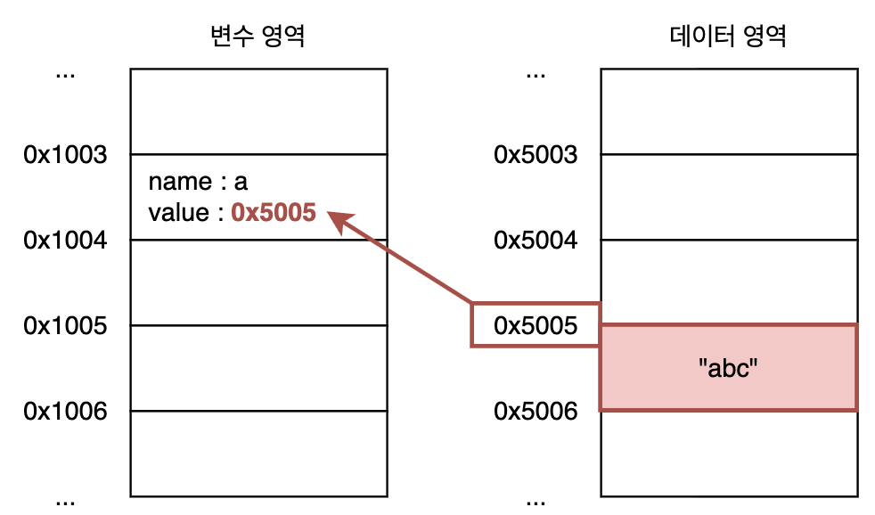
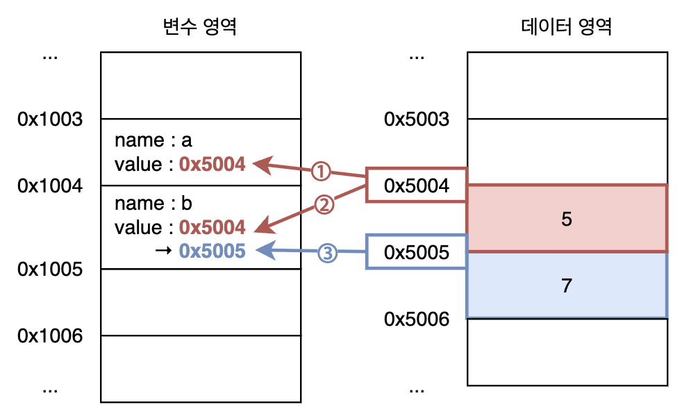

# Summary

## 1. Data Type

### 기본형 및 참조형 데이터의 메모리 동작 방식

- JavaScript는 변수를 선언하고 값을 할당하는 과정에서 메모리를 두 가지 영역으로 나누어 사용함
    - **변수 영역** : 변수에 할당되는 영역
    - **데이터 영역** : 실제 데이터를 저장하는 영역
- 일반적인 변수는 변수 영역에 메모리가 할당되고, 할당되는 값이 저장된 데이터 영역의 주소가 저장됨
- 기본형 데이터가 메모리에 저장되는 과정
    <br><br>
    1. 변수는 메모리의 변수 영역에 할당하고
    2. 값은 메모리의 데이터 영역에 할당해서 저장한 뒤
    3. 값이 저장된 데이터 영역 주소값을 변수에 저장
- 객체 등 참조형 데이터가 메모리에 저장되는 과정
    <br><br>
    1. 객체에 선언된 property들을 별도의 변수 영역에 할당하고,
    2. Property의 값은 데이터 영역에 저장한 뒤 그 주소값을 property의 변수 영역에 저장한 뒤,
    3. 객체의 property들이 저장된 변수 영역 메모리 주소를 데이터 영역에 저장해서,
    4. 3번의 데이터 영역 주소값을 객체를 저장하는 변수의 변수 영역 메모리에 저장
- 기본적으로 값은 데이터 영역에 저장되고 그 주소값이 변수에 할당되므로, 이미 데이터 영역에 존재하는 값은 메모리를 새로 할당하지 않고 기존 메모리 주소를 재활용할 수 있음
    <br><br>

### 불변성

- JavaScript에서 불변(immutable)은 **데이터 영역에 할당된 메모리에 저장된 값이 변경되지 않는 것**을 의미
- 기본형 데이터는 모두 불변값으로, 데이터 영역에서 메모리에 저장된 값을 변경하지 않고 항상 새로 메모리를 할당해서 저장한다.
- 객체 등 참조형 데이터 자체는 불변이지만 property는 변수 영역에 할당되므로 가변이다.
- 따라서, 객체 불변성을 확보하려면 항상 새로운 객체를 생성하는 방식으로 복사해야 한다.
    ```javascript
    function changeName(user, newName) {
        const newUser = user;        // ❌ 원본과 동일한 객체를 참조하여 원본 값에 영향을 줌
        const newUser = { ...user }; // ✅ 새로운 객체를 만들기때문에 원본에 영향을 주지 않음

        newUser.name = newName;
        return newUser;
    }
    ```
- Property가 객체를 값으로 갖는 경우, 중첩 객체들까지 깊은 복사가 이루어져야 한다.
    - 깊은 복사를 수행하는 함수를 직접 구현
        ```javascript
        function deepCopy(obj) {
            if (typeof obj === "object" && obj !== null) {
                const result = {};
                for (const key in obj) {
                    result[key] = deepCopy(obj[key]);
                }
                return result;
            } else {
                return obj;
            }
        }
        ```
        - [Object.hasOwnProperty](https://developer.mozilla.org/en-US/docs/Web/JavaScript/Reference/Global_Objects/Object/hasOwnProperty)를 사용해서 상속받은 property 제외 가능
        - [Object.getOwnPropertyDescriptor](https://developer.mozilla.org/en-US/docs/Web/JavaScript/Reference/Global_Objects/Object/getOwnPropertyDescriptor)를 사용해서 getter/setter 복사 가능
    - Method, hidden property, getter/setter 등을 제외한 순수 데이터만 복사한다면 JSON 직렬화/역직렬화를 통해 간단하게 구현 가능
        ```javascript
        function copy(obj) {
            return JSON.parse(JSON.stringify(obj));
        }
        ```

### undefined와 null

- `undefined` : JavaScript engine이 '값이 존재하지 않음'을 표현하기 위해 자동으로 부여하는 값
- `null` : 개발자가 명시적으로 '값이 없음'을 나타낼 때 사용하는 값
- 변수 선언 시 `undefined` 초기화 비교
    - `var`는 선언한 변수에 값이 할당되지 않아도 `undefined`로 즉시 초기화하므로, 초기화 구문이 실행되기 이전에 변수에 접근해도 `undefined`를 반환할 뿐 error가 발생하지 않았음
    - `let`, `const`는 변수 초기화 구문이 실제로 실행되기 전까지 `undefined`로 초기화하지 않으므로, 초기화 구문이 실행되기 이전에 변수에 접근하면 error 발생 -> **TDZ(Temporary Dead Zone) 형성**
    - `var`, `let`, `const` 변수 모두 호이스팅(hoisting)이 일어나지만, `undefined`로 초기화되는 시점이 달라서 동작 방식에 차이가 발생한다.
- 배열에서 `undefined`의 동작
    - `undefined`는 '값이 존재하지 않음'을 나타내지만 배열은 `undefined`를 값으로 취급
    - 배열도 객체의 일종이므로, 값이 `undefined`로 초기화 된 property를 갖기 때문
- `null`을 정확하게 체크하는 방법
    - `typeof` 연산자는 `null` 값에 대해 `object`를 반환하는 버그가 있음
    - `==` 연산자는 `undefined`와 `null`을 같다고 평가하므로, 피연산자가 `null`이 아닐 수 있음
    - **`===` 연산자는 정확히 `null`인 경우에만 같다고 평가**

## 02. Execution Context

- JavaScript는 함수 호출 시 '실행 컨텍스트'라는 개념적인 객체를 사용해서 함수를 실행할 때 필요한 환경 정보를 저장하고 사용
- 함수가 호출되는 시점에 실행 컨텍스트가 생성되고 `LexicalEnvironment`에 식별자 정보와 외부 환경 정보 저장
- `environmentRecord` : 매개변수, 변수, 함수 등 식별자 정보 저장
    - JavaScript engine은 코드를 실행하기 전에 먼저 식별자들을 수집해서 `environmentRecord`에 저장
    - 코드가 실행될 때는 변수, 함수가 코드의 맨 위로 끌어올려지는 것 처럼 동작함 -> **호이스팅(hoisting)**
    - 변수
        - 변수는 선언문만 호이스팅 되고, 값 할당은 실제 코드가 실행될 때 이루어짐
        - `var` : 식별자를 저장할 때 동시에 `undefined`로 초기화하므로, 초기화 구문 이전에 접근 가능
        - `let`, `const` : 먼저 '초기화되지 않은 상태'로 식별자를 저장하므로, 초기화 구문 이전에 접근하면 error 발생 -> **TDZ(Temporary Dead Zone)**
    - 함수
        - 함수는 변수에 함수 표현식이 할당되는 방식으로 호이스팅이 일어남
        - 함수 선언문은 식별자 호이스팅과 동시에 함수 표현식 형태로 초기화됨
        - 함수 표현식은 식별자만 호이스팅되고 초기화는 실제 초기화 구문 실행 시 동작 -> 일반 변수와 동일
- `outerEnvironmentReference` : 함수가 선언된 위치에서의 `LexicalEnvironment` 참조
    - **함수 코드가 실행되는 시점에 결정**되고, **함수가 실제로 호출되는 시점에 설정**됨
    - `outerEnvironmentReference`를 통해 `LexicalEnvironment`들이 연결되는 scope chain 형성
    - 변수, 함수에 접근 시 `LexicalEnvironment`부터 시작해서 scope chain을 따라 전역 context까지 **해당 식별자가 존재하는 가장 가까운 `LexicalEnvironment`를 탐색**

### VariableEnvironment의 필요성

- ES3 에서는 실행 컨텍스트가 `VariableObject` 객체에 정보를 저장함 (`arguments`, 지역 변수, `this`, scope 정보 등)
- ES6+ 에서 `VariableEnvironment`와 `LexicalEnvironment` 두 가지로 분리해서 사용
    - `var` 변수는 함수 scope를 갖기 때문에 함수 내부의 block이 함수와 동일한 environment를 사용해도 됨 -> `VariableEnvironment` 사용
    - `let`, `const` 변수는 block scope를 갖기 때문에 내부 block이 독립적인 environment를 가져야 함 -> `LexicalEnvironment` 사용
    - `VariableEnvironment`는 함수 안에서 단일 환경 record를 제공하기 위해 사용
    - `LexicalEnvironment`는 block 마다 독립적인 여러 개의 환경 record를 제공하기 위해 사용
- `var` 변수와 `let`, `const` 변수의 생성 과정 비교
    - 변수는 선언, 초기화, 할당 3가지 단계를 거쳐 생성됨
    - `var` 변수는 `VariableEnvironment`에 식별자가 먼저 저장되고(선언) `LexicalEnvironment`를 생성할 때 값이 초기화됨
    - `let`,` const` 변수는 처음부터 `LexicalEnvironment`에 초기화되지 않은 상태로 식별자를 저장하고, 변수 선언문이 실행될 때 `undefined`로 초기화됨
- 결론
    - `LexicalEnvironment`는 `let`, `const` 등 새로운 변수의 block scope 동작을 지원하기 위해 사용된다.
    - `VariableEnvironment`는 `var` 변수에 대한 호환성을 지원하기 위해 사용되었다.
    - 하지만, ES6+ 이후부터는 `var` 변수도 `LexicalEnvironment`를 사용하도록 변경되었고 `VariableEnvironment`는 거의 고려하지 않아도 될 것 같다.

## 03. this

- 전역 공간에서 `this` : 전역 객체 (브라우저는 `window`, Node.js는 `global` 또는 `globalThis`)
- 함수 내부에서 `this` : 호출 주체
    - 함수 단독 호출 : `this`에 전역 객체 binding
    - Method로 호출 : `this`에 호출한 객체 binding
- Calback 함수에서 `this` : 제어권을 넘겨준 함수가 설정하는 객체
    - `addEventListener()` : event가 발생한 객체로 binding
    - `forEach()` 등 배열 고차 함수 : 해당 배열로 binding
    - `setTimeout()` : 별도로 binding 하지 않음 (전역 객체)
- 생성자 함수에서 `this` : 생성자 함수의 `prototype`을 참조하는 `__proto__` property를 가진 객체를 생성한 뒤 binding
- `this`와 화살표 함수
    - 중첩 함수 내부에서 `this`는 중첩 함수를 단독으로 호출할 때 전역 객체가 됨
    - 하지만, 상위 함수의 `this`를 그대로 따라가는 것이 더 자연스러움
    - ES6 에서는 이 문제를 화살표 함수로 해결
    - 화살표 함수는 자체적인 `this` binding을 갖지 않으므로 scope chain을 따라 상위 함수의 `this` binding을 탐색
    - 화살표 함수를 사용하면 중첩 함수가 상위 함수의 `this`를 `self` 등의 변수로 받아서 활용하는 기법을 사용하지 않아도 됨
- 명시적 `this` binding
    - `call(thisArg[, arg1, arg2, ...])`/`apply(thisArg[, args])` : `this` binding을 명시적으로 설정해서 호출
    - `bind(thisArg[, arg1, arg2, ...])` : `this` binding을 명시적으로 설정한 새로운 함수 생성
    - Callback 함수를 받는 일부 함수들은 callback 함수의 `this`를 설정할 수 있는 `thisArg` argument 제공 (e.g. `forEach`, `map`, ...)

## 04. Callback

- Callback 함수 : argument를 통해 다른 함수로 전달되는 함수
- Callback 함수는 다른 함수에게 제어권을 함께 위임
    - Callback을 받는 함수는 callback의 호출 시점, 전달 인자, `this` binding 등을 결정
    - Callback 함수가 객체 method 이더라도, 호출 제어권을 내부 함수가 갖기 때문에 `this`가 객체가 아닐 수 있음
    - `bind()`를 사용해서 `this`가 원하는 객체로 binding 된 callback을 전달할 수 있음
- 비동기 코드와 callback
    - 비동기 코드 작성 시, 이전 작업에 의존성이 있는 비동기 작업이 여러 번 중첩되면서 callback 지옥을 만듦
    - `Promise`, generator(`function *`, `yield`), `async`/`await` 등의 방법으로 해결

## 05. Closure

- Closure : 함수와 함수가 선언될 당시의 lexical environment의 조합
    - 함수가 선언될 당시의 lexical environment : `outerEnvironmentReference`가 참조하는 `LexcialEnvironment`
    - 즉, closure는 **내부 함수가 외부의 변수를 참조하는 상황에서만 발생**하는 현상
- 외부 함수에 선언된 지역 변수를 참조하는 내부 함수를 외부로 전달할 때 발생
    - 내부 함수를 외부로 전달하는 방법 : `return`문 반환, 다른 함수의 callback으로 전달 등
    - 내부 함수의 context가 `outerEnvironmentReference`를 통해 외부 함수의 지역 변수를 참조함
    - 외부 함수의 실행이 종료되더라도, 외부로 전달된 내부 함수가 외부 함수의 지역 변수를 참조하므로 GC가 발생하지 않고 메모리를 유지할 수 있음
    - 즉, **이미 종료된 함수의 지역 변수에 함수 종료 이후에도 계속 접근할 수 있음**
- Callback 함수 내부에서 외부 데이터 사용, access control 구현, 부분 적용 함수 구현 등에 활용

## 06. Prototype

- Prototype : 생성자 함수로 만든 객체(instance)들이 공통으로 접근할 수 있는 객체
- 생성자 함수가 만든 객체는 생성자 함수의 `prototype` 객체를 참조하는 `[[prototype]]` slot (또는 `__proto__` property)를 가짐
- 즉, 생성자 함수로 만든 객체는 `__proto__` property를 통해 생성자 함수의 `prototype` 객체에 정의된 property 및 method에 접근 가능 
    <br/><br/>
    ```javascript
    function Person(name) {
        this._name = name;
    }
    Person.prototype.getName = function () {
        return this._name;
    }

    const suzi = new Person("Suzi");
    suzi.__proto__.getName(); // undefined
    suzi.getName(); // Suzi (`__proto__` 생략 가능)
    ```
- 배열에서 사용하는 method들은 `Array` 생성자 함수의 `prototype`에 정의되어 있는 것을 사용하는 것
    <br/><br/>
- `prototype`에 선언된 가진 `constructor` property는 생성자 함수 자신을 참조 
- Prototype chain
    - `prototype`도 객체이므로 `__proto__` property를 가짐
    - 이 때, 생성자 함수가 만든 객체에서 시작해서 `__proto__` property를 따라 prototype chain이 형성됨
    - `__proto__` property가 참조하는 `prototype` 객체가 `__proto__` property를 통해 다른 `prototype`과 연결되는 것
    - 객체는 자신이 가진 property에서 시작하여 prototype chain을 따라 가장 가까운 `prototype`에 선언된 property를 참조
- `Object.prototype`
    - 생성자 함수는 객체를 반환
    - JavaScript의 모든 값은 내부적으로 생성자 함수를 통해 만들어지므로 모든 값의 prototype chain의 최상단에는 `Object.prototype`이 존재
    - 모든 값에서 `toString()` 함수를 사용할 수 있는 이유 (`Object.prototype.toString()`)