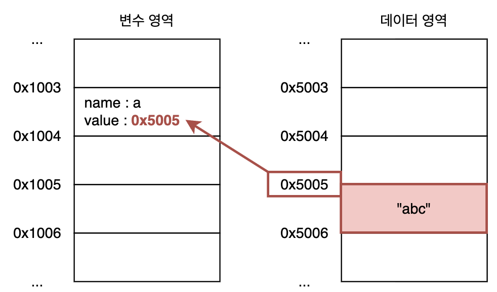
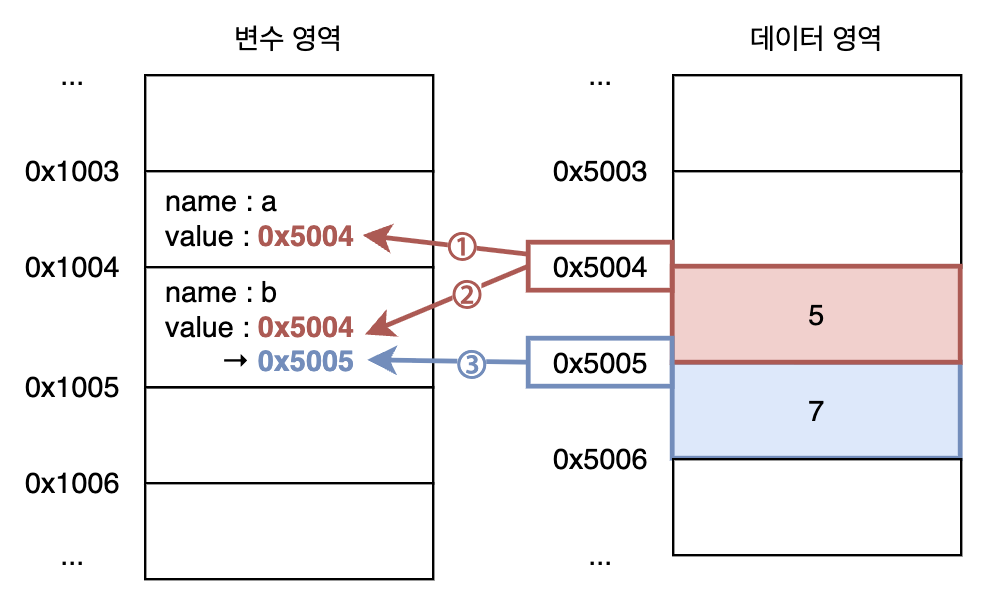
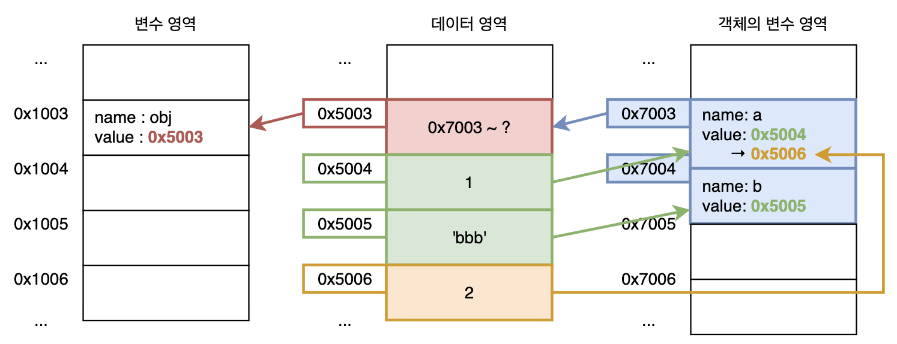

# Data Type

## Data type의 종류

- **기본형(primitive type)** : number, string, boolean, null, undefined, symbol
- **참조형(reference type)** : object (array, function, Set, Map, Date, RegExp, ...)

## 변수 선언과 데이터 할당

- **변수 선언** : 메모리의 일정 공간을 할당받고 식별자(변수 이름)을 붙이는 것
- **데이터 할당** : 데이터를 별도의 메모리 공간에 저장하고 변수에 그 주소값을 저장하는 것
- JavaScript는 데이터의 성질에 따라 메모리 공간을 '**변수 영역**'과 '**데이터 영역**'으로 구분
    - 값을 저장하는데 필요한 메모리 공간이 가변적일 때, 값을 변수에 직접 저장하면 변수 선언을 위해 확보한 메모리 공간의 크기를 늘려야 한다.
    - 그런데, 미리 확보된 메모리 공간을 늘리는 작업을 수행하려면 처리해야 할 연산량이 많아진다.
    - 데이터 변환을 효율적으로 처리하기 위해 JavaScript는 **데이터를 별도의 메모리 공간에 저장하고 변수에는 그 주소값을 저장**한다.
    - 변수는 실제 값보다 상대적으로 작고 고정된 크기의 주소값을 저장하므로 데이터가 변경되어도 효율적으로 처리할 수 있다.
- 변수 `a`에 `abc` 문자열을 할당하는 코드의 동작 방식
    ```javascript
    var a = "abc";
    ```
    1. 변수 영역에 메모리 공간을 할당받고(`0x1003`) `a`라는 식별자(`name`)를 연결
    2. 데이터 영역에 메모리 공간을 할당받고(`0x5005`) `"abc"` 값을 저장
    3. `"abc"`가 저장된 데이터 영역의 주소값(`0x5005`)을 변수 `a` 주소의 값으로 저장
    

## 기본형 데이터와 참조형 데이터

- 변수(variable)와 상수(constant)는 '변수 영역 메모리의 값에 대한 변경 가능성'을 기준으로 구분
- **불변성(immutability)** 은 '**데이터 영역 메모리의 값**에 대한 변경 가능성'을 기준으로 구분
- 즉, 불변성은 '**데이터 영역 메모리의 값을 변경할 수 없다**'는 것을 의미함
- JavaScript의 기본형 데이터는 모두 불변값으로, **값을 변경하려면 항상 새로운 값을 만들어야 한다.**
    - 숫자 `5`를 `7`로 바꾸는 경우, `5`가 저장된 데이터 영역 메모리의 값을 변경하는 것이 아님
    - 숫자 `7` 값을 새로 만들고 다른 데이터 영역 메모리에 저장한 다음 그 주소값을 사용
    - 이 때, JavaScript는 데이터를 만들기 전에 이미 해당 값이 메모리에 존재하는지 먼저 확인함
        - 데이터 영역 메모리에 같은 값이 저장되어 있다면 그 메모리 주소를 **재활용**
        - 데이터 영역 메모리에 같은 값이 없다면 새로 만들어서 저장한 뒤 그 주소를 사용
    - 예시
        ```javascript
        var a = 5;
        var b = 5;
        b = 7;
        ```
        1. 변수 영역에 `a` 이름으로 메모리 공간 할당
        2. 데이터 영역에 숫자 `5`가 없으므로, 새로 저장한 뒤 변수 `a`의 메모리 공간에 그 주소를 저장
        3. 변수 영역에 `b` 이름으로 메모리 공간 할당
        4. 데이터 영역에서 숫자 `5`가 저장된 주소를 변수 `b`의 메모리 공간에 저장
        5. 데이터 영역에 숫자 `7`을 저장한 뒤, 변수 `b`의 메모리 공간의 값을 새로 할당한 주소로 교체
        
- JavaScript의 참조형 데이터(객체)는 값을 직접 변경할 수 있는 '가변값'으로 알려져 있지만, **메모리 상에서는 불변값이다.**
    - JavaScript 객체는 둘 이상의 데이터를 갖는 collection으로, **내부에 포함된 데이터를 위한 별도의 변수 영역**을 가짐
    - 객체의 property 값을 변경하는 것은 '**객체의 변수 영역**' 메모리의 값을 변경하는 것
    - 객체를 저장한 변수에는 객체의 데이터들이 저장된 주소가 저장되고, 이 주소는 직접 변경할 수 없음 → "**데이터 영역에서 객체는 불변값이다.**"
    - 하지만, 객체 변수 영역에서 값을 바꾸면 `obj` 변수 입장에서는 객체가 변경된 것처럼 보인다 → "**변수 영역에서 객체는 가변값이다.**"
    - 예시
        ```javascript
        var obj = { a: 1, b: 'bbb' };
        obj.a = 2;
        ```
        1. 변수 영역에 `obj` 이름으로 메모리 공간 할당
        2. `obj`에 할당하는 값은 객체이므로, property들을 저장하기 위한 별도의 변수 영역 메모리를 할당하고 그 주소를 데이터 영역 메모리에 저장
        3. 변수 `obj` 메모리 공간에는 객체 주소가 저장된 데이터 영역 메모리 주소를 저장
        4. 숫자 `1`과 `bbb` 값을 데이터 영역에서 찾고, 없으면 새로 생성한 뒤 메모리를 할당해서 저장
        5. 객체 변수 영역에 property `a`와 `b`를 위한 메모리를 할당하고, 4번에서 할당한 데이터 영역 메모리 주소를 각각 저장
        
    - 위 예시에서, 숫자 `1`이 저장된 메모리는 참조하는 곳이 없으므로 나중에 가비지 컬렉터에 의해 정리될 수 있다.
- 기본형 데이터와 참조형 데이터의 메모리 동작 방식을 고려하면, **기본형 데이터와 참조형 데이터의 변수 복사 동작에는 차이가 없다.**
    - 변수를 복사했을 때 두 변수가 동일한 '데이터 영역 메모리 주소'를 바라보게 되는 점에서 동일하다.
        ```javascript
        var a = 10; // 변수 `a`에 `10`이 저장된 데이터 영역 메모리 `0x5003` 저장
        var b = a; // 변수 `b`의 변수 영역 메모리 공간에 `0x5003` 주소가 복사됨

        var obj1 = { c: 10, d: "ddd" }; // 변수 `obj1`에 객체 주소가 저장된 데이터 영역 메모리 `0x5004` 저장
        var obj2 = obj1; // 변수 `obj2` // 변수 `obj2`의 변수 영역 메모리 공간에 `0x5004` 주소가 복사됨
        ```
    - 복사된 변수에 값을 변경할 때 차이가 발생한다.
        ```javascript
        b = 15; // `15`를 데이터 영역 메모리를 새로 할당받아 저장하고 변수 `b`에 새 주소를 저장
        console.log(a === b); // false. 변수 `a`와 `b`가 가리키는 데이터 영역 주소가 다르다. (값이 다르다.)

        obj2.c = 20; // 객체 property의 변수 영역 메모리 공간의 값을 변경하는 것
        console.log(obj1 === obj2); // true. 변수 `obj1`과 `obj2`가 여전히 동일한 데이터 영역 주소를 가리킨다.
        ```
    - `obj2` 변수에 새 객체를 할당한다면, `obj2` 변수의 값은 새 객체의 주소가 저장된 데이터 영역 메모리 주소가 되어 `obj1`과 다른 주소를 바라보게 된다.
        ```javascript
        obj2 = { c: 20, d: "ddd" };
        console.log(obj1 === obj2); // false. 이제 변수 `obj1`과 `obj2`가 다른 데이터 영역 주소를 가리킨다.
        ```
- JavaScript의 기본형 및 참조형 값들은 변수에 저장될 때 모두 **주소가 저장된다**. 
    - 기본형 데이터는 그 주소에 실제 값이 들어있고,
    - 참조형 데이터는 그 주소에 내부 값들이 저장된 또다른 주소가 들어 있다. (두 단계를 거침)