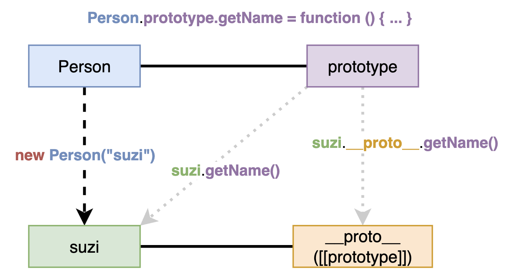

# Prototype

## `__proto__`와 `prototype`

- Prototype 기반 언어는 어떤 객체를 원형(prototype)으로 삼고 이를 복제(참조)하여 상속과 비슷한 효과를 얻음
- 어떤 생성자 함수(constructor)를 `new` 연산자와 함께 호출하면 `__proto__` 숨김 property를 가진 새 객체(instance)가 생성됨
    - ES5.1 명세에는 `__proto__`가 아닌 `[[prototype]]`으로 정의되어 있음
    - 원래는 constructor의 `prototype` property에 접근하려면 `Object.getPrototypeOf(instance)` 또는 `Reflect.getPropertyOf(instance)`를 사용해야 했음
    - 하지만, 대부분의 브라우저들이 `__proto__`에 직접 접근하는 방식을 유지했고, ES6 에서는 브라우저에서 동작하는 레거시 코드에 대한 호환성을 위해 `__proto__`를 정식으로 인정
    - `__proto__`가 정식 스펙으로 정의되긴 했지만 권장되는 방식은 아님
- **`__proto__` property는 constructor의 `prototype` property를 참조**하므로, instance는 `__proto__`를 통해 constructor의 `prototype` 객체의 member들에 접근 가능
    ```javascript
    function Person(name) {
        this._name = name;
    }
    Person.prototype.getName = function () {
        return this._name;
    }

    const suzi = new Person("Suzi");
    suzi.__proto__.getName(); // undefined
    ```
- 이 때, `getName()` 함수의 `this` binding은 instance(`suzi`)가 아닌 `prototype` 객체(`suzi.__proto__`)이기 때문에 `undefined`가 반환됨
    - `undefined`가 출력된다는 것은 `getName()` method에 정상적으로 접근해서 호출할 수 있다는 것
    - `getName()` method를 호출하는 객체는 `suzi.__proto__`인데, constructor의 `prototype` 객체에는 `_name`이라는 property가 없기 때문에 `undefined`가 반환됨
- **`__proto__` property는 생략 가능**하므로, instance가 `getName()`에 직접 접근해서 호출하면 `this`를 instance(`suzi`)에 binding 할 수 있음
    ```javascript
    const suzi = new Person("Suzi");
    suzi.getName(); // Suzi
    ```
    - `getname()` method를 호출하는 객체가 `suzi`가 되어 `_name` property에 접근 가능해짐
- 동작 방식 요약
    <div></div>

> - Instance를 통해 접근하기 때문에 MDN 문서에서는 prototype member들을 'instance property', 'instance method' 라고 부름
>   - [Instance properties | MDN Array](https://developer.mozilla.org/en-US/docs/Web/JavaScript/Reference/Global_Objects/Array#instance_properties)
>   - [Instance methods | MDN Array](https://developer.mozilla.org/en-US/docs/Web/JavaScript/Reference/Global_Objects/Array#instance_methods)
> - Class 기반 언어들에서 class instance로 접근할 수 있는 property 및 method의 표현 방식과 비슷

### 배열(`Array`)에서 prototype 구조 예시


- 배열 literal은 내부적으로 `Array` 생성자 함수를 통해 생성되는 instance임
- 배열에서 사용 가능한 method들은 `Array.prototype`에 정의되어 있음 (e.g. [`Array.prototype.concat()`](https://developer.mozilla.org/en-US/docs/Web/JavaScript/Reference/Global_Objects/Array/concat), [`Array.prototype.fill()`](https://developer.mozilla.org/en-US/docs/Web/JavaScript/Reference/Global_Objects/Array/fill))
- `prototype`이 아닌 `Array` 생성자 자체에 선언된 method들은 instance에서 접근할 수 없음 (e.g. [`Array.from()`](https://developer.mozilla.org/en-US/docs/Web/JavaScript/Reference/Global_Objects/Array/from), [`Array.isArray()`](https://developer.mozilla.org/en-US/docs/Web/JavaScript/Reference/Global_Objects/Array/isArray))

### `constructor` property

- 생성자 함수의 `prototype` 객체에는 생성자 함수 자기 자신을 참조하는 `constructor` property가 존재
- Instance로부터 원형이 무엇인지 파악하기 위해 사용됨
    ```javascript
    let arr = [1, 2];
    Array.prototype.constructor === Array; // true
    arr.__proto__.constructor === Array; // true
    arr.constructor === Array; // true

    let arr2 = new arr.constructor(3, 4); // equals to `new Array(3, 4)`
    ```
- 기본형 literal 변수를 제외하고 `constructor` 값 변경 가능 (type은 변하지 않음)
    ```javascript
    let NewConstructor = function () { 
        console.log("this is new constructor");
    }
    let str = new String();
    str.constructor = NewConstructor;
    console.log(str.constructor.name, "&", str instanceof NewConstructor); // NewConstructor & false
    ```

## Prototype Chain

- **Prototype chain** : 어떤 data의 `__proto__` property 내부에 다시 `__proto__` property가 연쇄적으로 이어진 것
- **Prototype chaining** : chain을 따라가며 property 또는 method를 검색하는 것
- **Override** : instance가 prototype에 정의된 것과 동일한 이름의 property 또는 method를 가져서 구현을 덮어쓰는 것
- Property 및 method 탐색 과정
    ```javascript
    function Person(name) {
        this._name = name;
    }
    Person.prototype.getName = function () {
        return this._name;
    }

    let p1 = new Person("Kim");
    p1.getName = function () {
        return `Overriding: ${this._name}`;
    }
    p1.getName(); // Overriding: Kim -> 자기 자신의 `getName()` method를 먼저 실행
    ```
    1. 가장 가까운 자신의 property 또는 method 탐색
    2. 찾지 못하면 그 다음으로 가까운 `__proto__`에서 탐색
    3. 찾지 못하면 최상위 `__proto__`까지 연쇄적으로 탐색
- Prototype chaining을 무시하고 특정 prototype에 선언된 method를 호출할 때는 `call`/`apply` 등으로 `this` binding에 신경써야 함
    ```javascript
    p1.__proto__.getName(); // undefined
    p1.__proto__.getName.call(p1); // Kim
    ```

### Prototype chain

- 생성자 함수의 `prototype` property는 객체이므로, 기본적으로 모든 객체의 `__proto__`에는 `Object.prototype`이 연결됨
- 배열의 `__proto__`는 `Array.prototype`을 참조하고 이것은 또 `Object.prototype`을 참조하므로, 배열은 `Array.prototype.toString()`과 `Object.prototype.toString()` 중에 어떤 것을 호출할 지 선택해야 함 (chaining 규칙에 의해 가장 가까이에 있는 `Array.prototype.toString()`을 호출할 것)
    ```javascript
    let arr = [1, 2];
    Array.prototype.toString.call(arr); // [1, 2];
    Object.prototype.toString.call(arr); // [object Array]
    arr.toString(); // [1, 2]
    ```

### 객체 전용 method

- 모든 생성자 함수의 `prototype` property의 값은 객체이므로, 모든 data의 prototype chain의 최상단에는 항상 `Object.prototype`이 존재함
- 원시 자료형 값도 내부적으로 `Number`, `String` 등 생성자 함수가 사용되므로 prototype chain의 최상단에 `Object.prototype`이 존재
- 따라서, **객체에서만 사용할 property나 method는 `Object.prototype` 내부에 정의하면 다른 자료형 값들도 접근 가능해지므로 `Object`의 static method로만 선언할 수 밖에 없음**
    - 이 때, static method는 객체를 통하지 않아서 `this`가 유실되는 문제를 방지하기 위해 `this`에 해당하는 instance를 argument로 직접 전달
    - e.g. `Object.freeze(instance)`, `Object.getPrototypeOf(instance)`
- 반대로, `Object.prototype`에는 어떤 자료형에서도 활용할 수 있는 범용적인 method만 선언됨
    - e.g. `toString()`, `hasOwnProperty`, `valueOf`, `isPrototypeOf`

### 다중 prototype chain

- 대부분의 JavaScript 내장 자료형들은 prototype chain이 1-2단계에서 끝남
- 사용자가 `__proto__` property에 다른 객체를 연결해 나가면 무한대로 chain을 만들 수 있다.
    - 다른 언어에서 class를 여러 단계에 걸쳐 상속하는 것과 비슷하게 구현 가능
- 유사배열 객체에 배열 method들을 직접 사용할 수 있게 연결하는 방법
    ```javascript
    function Grade() {
        let args = Array.prototype.slice.call(arguments);
        for (let i = 0; i < args.length; i++) {
            this[i] = args[i];
        }
        this.length = args.length;
    }

    let g = new Grade(100, 80);
    console.log(g); // { 0: 100, 1: 80, length: 2 }

    Grade.prototype = []; // `Grade`의 prototype을 배열 instance로 설정하여 `Array.prototype`에 연결
    console.log(g); // [100, 80]

    g.push(60); // `Array.prototype.push()`에 접근 가능
    console.log(g); // [100, 80, 60]
    ```
    -  `g.__proto__`는 배열 instance를 참조
    - 배열 instance의 `__proto__`는 `Array.prototype`을 참조
    - 따라서, `g.__proto__.__proto__`는 `Array.prototype`에 정의된 method에 접근 가능
    - `__proto__`는 생략 가능한 객체이므로 `g` instance가 `Array.prototype`에 정의된 method에 직접 접근 가능